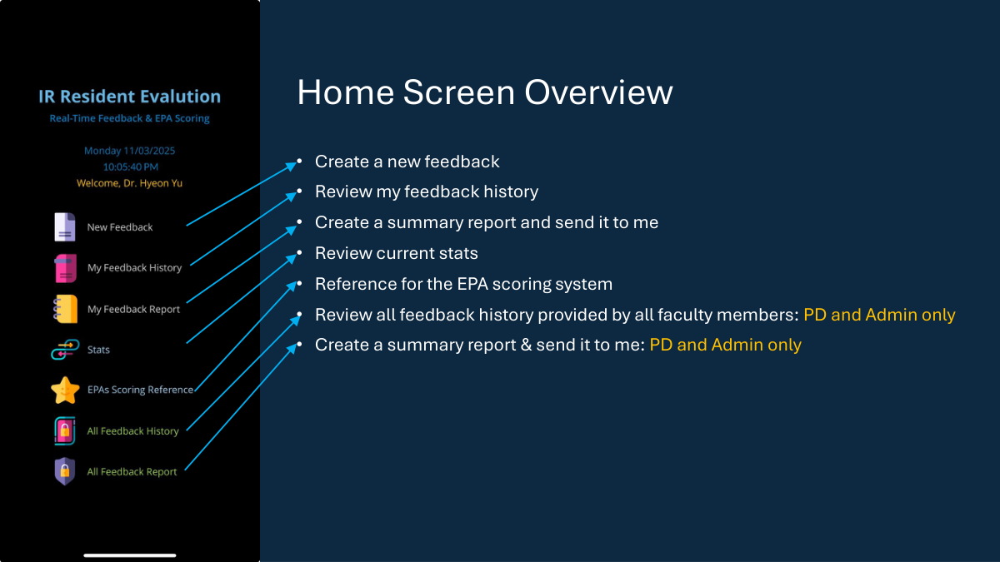
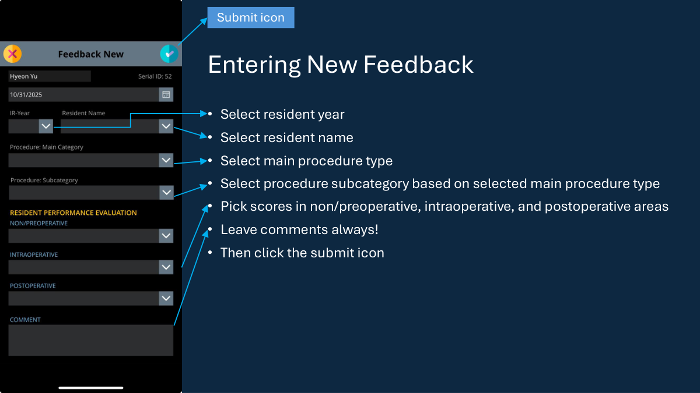
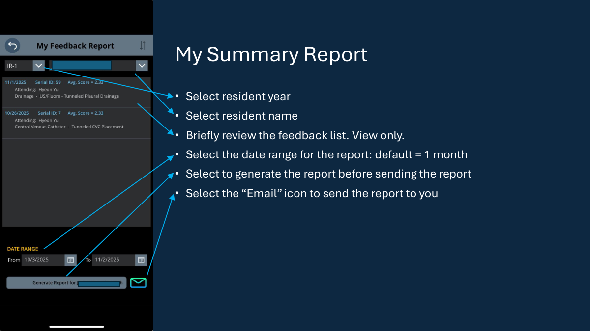

# UNC VIR Resident Evaluation

Canvas app for resident evaluation built in Microsoft Power Apps with SharePoint-backed data sources.

This repository is intended to be usable by outside institutions without direct one-on-one walkthroughs. It contains:
- an importable Power Apps canvas app package
- SharePoint starter data and schema templates
- setup and reconnection instructions
- implementation and validation checklists
- a visual user guide with screenshots from the app

## Start Here

If you are evaluating or adopting this app for another institution, read these in order:
1. [`docs/START_HERE.md`](/c:/Users/hyeon/Documents/miniconda_medimg_env/ms-powerapps-projects/unc-vir-resident-evaluation/docs/START_HERE.md)
2. [`docs/COMPREHENSIVE_MANUAL.md`](/c:/Users/hyeon/Documents/miniconda_medimg_env/ms-powerapps-projects/unc-vir-resident-evaluation/docs/COMPREHENSIVE_MANUAL.md)
3. [`docs/assets/Resident_Evaluation_Implementation_Manual.pdf`](/c:/Users/hyeon/Documents/miniconda_medimg_env/ms-powerapps-projects/unc-vir-resident-evaluation/docs/assets/Resident_Evaluation_Implementation_Manual.pdf)
4. [`docs/SETUP_GUIDE.md`](/c:/Users/hyeon/Documents/miniconda_medimg_env/ms-powerapps-projects/unc-vir-resident-evaluation/docs/SETUP_GUIDE.md)
5. [`docs/CONNECTION_MAP.md`](/c:/Users/hyeon/Documents/miniconda_medimg_env/ms-powerapps-projects/unc-vir-resident-evaluation/docs/CONNECTION_MAP.md)
6. [`docs/IMPLEMENTATION_CHECKLIST.md`](/c:/Users/hyeon/Documents/miniconda_medimg_env/ms-powerapps-projects/unc-vir-resident-evaluation/docs/IMPLEMENTATION_CHECKLIST.md)
7. [`docs/TROUBLESHOOTING.md`](/c:/Users/hyeon/Documents/miniconda_medimg_env/ms-powerapps-projects/unc-vir-resident-evaluation/docs/TROUBLESHOOTING.md)
8. [`docs/USER_GUIDE.md`](/c:/Users/hyeon/Documents/miniconda_medimg_env/ms-powerapps-projects/unc-vir-resident-evaluation/docs/USER_GUIDE.md)

## What This Repository Contains

- [`app/releases`](/c:/Users/hyeon/Documents/miniconda_medimg_env/ms-powerapps-projects/unc-vir-resident-evaluation/app/releases)
  - the single latest importable `.msapp` file
- [`sharepoint-templates/dummy`](/c:/Users/hyeon/Documents/miniconda_medimg_env/ms-powerapps-projects/unc-vir-resident-evaluation/sharepoint-templates/dummy)
  - recommended SharePoint import files for external institutions
- [`sharepoint-templates/template`](/c:/Users/hyeon/Documents/miniconda_medimg_env/ms-powerapps-projects/unc-vir-resident-evaluation/sharepoint-templates/template)
  - minimal example CSV files
- [`sharepoint-templates/blank`](/c:/Users/hyeon/Documents/miniconda_medimg_env/ms-powerapps-projects/unc-vir-resident-evaluation/sharepoint-templates/blank)
  - header-only CSV files
- [`docs`](/c:/Users/hyeon/Documents/miniconda_medimg_env/ms-powerapps-projects/unc-vir-resident-evaluation/docs)
  - adoption, setup, troubleshooting, and maintenance documentation
- [`docs/screenshots`](/c:/Users/hyeon/Documents/miniconda_medimg_env/ms-powerapps-projects/unc-vir-resident-evaluation/docs/screenshots)
  - selected app screenshots for onboarding and user documentation
- [`docs/assets/Power_Apps_VIR_Resident_Evaluation_User_Guide.pdf`](/c:/Users/hyeon/Documents/miniconda_medimg_env/ms-powerapps-projects/unc-vir-resident-evaluation/docs/assets/Power_Apps_VIR_Resident_Evaluation_User_Guide.pdf)
  - full slide-based visual guide
- [`docs/assets/Resident_Evaluation_Implementation_Manual.pdf`](/c:/Users/hyeon/Documents/miniconda_medimg_env/ms-powerapps-projects/unc-vir-resident-evaluation/docs/assets/Resident_Evaluation_Implementation_Manual.pdf)
  - downloadable implementation manual
- [`_unpacked`](/c:/Users/hyeon/Documents/miniconda_medimg_env/ms-powerapps-projects/unc-vir-resident-evaluation/_unpacked)
  - unpacked app source for review and diffing

## What the App Looks Like

Home screen overview:

Entering new feedback:

My summary report:

## Quick Adoption Summary

To implement this app at another institution:
1. Create four SharePoint lists with the exact expected names.
2. Import the recommended dummy or template CSV files.
3. Import the latest `.msapp` into Power Apps.
4. Reconnect the app to the local SharePoint lists and Outlook connector.
5. Run the smoke-test checklist before production use.

Expected SharePoint list names:
- `VIR_RealTime_FeedBack`
- `Procedure_Categories_01`
- `Resident_Year_Name_01`
- `AttendingList`

## Recommended Files for New Institutions

Use these first:
- [`AttendingList.dummy.csv`](/c:/Users/hyeon/Documents/miniconda_medimg_env/ms-powerapps-projects/unc-vir-resident-evaluation/sharepoint-templates/dummy/AttendingList.dummy.csv)
- [`Resident_Year_Name_01.dummy.csv`](/c:/Users/hyeon/Documents/miniconda_medimg_env/ms-powerapps-projects/unc-vir-resident-evaluation/sharepoint-templates/dummy/Resident_Year_Name_01.dummy.csv)
- [`Procedure_Categories_01.dummy.csv`](/c:/Users/hyeon/Documents/miniconda_medimg_env/ms-powerapps-projects/unc-vir-resident-evaluation/sharepoint-templates/dummy/Procedure_Categories_01.dummy.csv)
- [`VIR_RealTime_FeedBack.dummy.csv`](/c:/Users/hyeon/Documents/miniconda_medimg_env/ms-powerapps-projects/unc-vir-resident-evaluation/sharepoint-templates/dummy/VIR_RealTime_FeedBack.dummy.csv)

These dummy files are non-sensitive and intentionally compatible with the app.

## Visual User Documentation

For end-user workflow screenshots and a slide-based walkthrough:
- [`docs/USER_GUIDE.md`](/c:/Users/hyeon/Documents/miniconda_medimg_env/ms-powerapps-projects/unc-vir-resident-evaluation/docs/USER_GUIDE.md)
- [`Power_Apps_VIR_Resident_Evaluation_User_Guide.pdf`](/c:/Users/hyeon/Documents/miniconda_medimg_env/ms-powerapps-projects/unc-vir-resident-evaluation/docs/assets/Power_Apps_VIR_Resident_Evaluation_User_Guide.pdf)

## Downloadable Manual

For a single step-by-step document suitable for sharing or downloading:
- [`COMPREHENSIVE_MANUAL.md`](/c:/Users/hyeon/Documents/miniconda_medimg_env/ms-powerapps-projects/unc-vir-resident-evaluation/docs/COMPREHENSIVE_MANUAL.md)
- [`Resident_Evaluation_Implementation_Manual.pdf`](/c:/Users/hyeon/Documents/miniconda_medimg_env/ms-powerapps-projects/unc-vir-resident-evaluation/docs/assets/Resident_Evaluation_Implementation_Manual.pdf)

## Required Microsoft 365 Dependencies

- SharePoint Online
- Office 365 Outlook connector

## Critical Implementation Rules

- SharePoint list names should match the expected app data source names exactly.
- SharePoint column names should also match exactly unless you plan to modify app formulas.
- The app relies on `AttendingEmail` for stable ownership filtering.
- `AttendingRole` in `AttendingList` controls PD/admin access.
- Procedure filtering assumes `Procedure_Categories_01.Title` is the main category field.

## For Maintainers

If you are updating the source repository itself:
- [`docs/RELEASE_WORKFLOW.md`](/c:/Users/hyeon/Documents/miniconda_medimg_env/ms-powerapps-projects/unc-vir-resident-evaluation/docs/RELEASE_WORKFLOW.md)
- [`docs/REPOSITORY_POLICY.md`](/c:/Users/hyeon/Documents/miniconda_medimg_env/ms-powerapps-projects/unc-vir-resident-evaluation/docs/REPOSITORY_POLICY.md)
- [`CHANGELOG.md`](/c:/Users/hyeon/Documents/miniconda_medimg_env/ms-powerapps-projects/unc-vir-resident-evaluation/CHANGELOG.md)

## Privacy

Do not commit or share real resident, attending, or evaluation data unless disclosure is intentional and approved.
