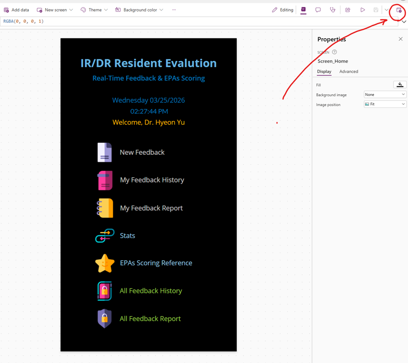
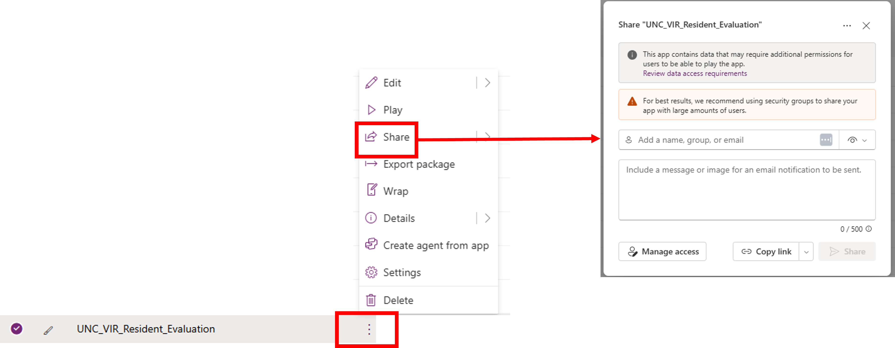
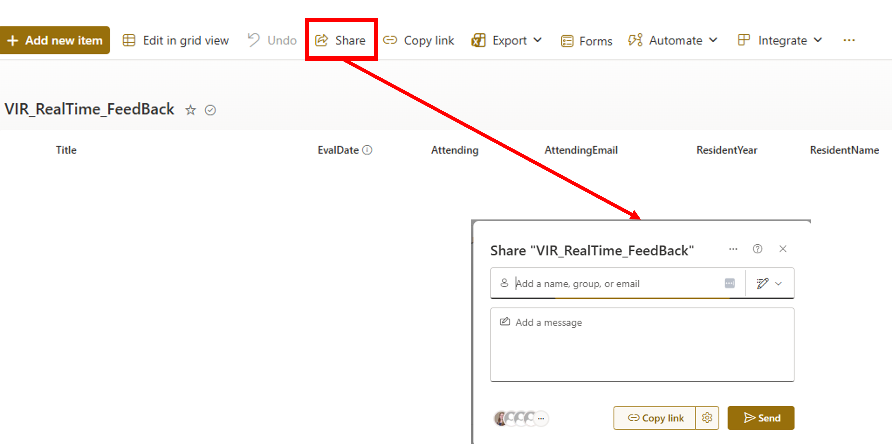

# Post-Setup Rollout Guide

This guide is for the local owner after the app has already been:
- imported successfully
- connected to the four SharePoint lists
- tested with at least one successful feedback submission

At that point, the next step is local rollout to faculty users.

## What This Guide Covers

- how to share the Power Apps app with faculty
- how to share the SharePoint lists the app depends on
- what permissions users need
- how to confirm faculty can actually submit feedback
- how to confirm leadership users can access broader reporting views

## Important Principle

Sharing the app alone is not enough.

Users also need access to the connected SharePoint lists. If the app is shared but the lists are not, faculty may be able to open the app but still fail to read or submit data.

Leadership and admin visibility also depend on `AttendingList`, especially:
- `EmailAddress`
- `AttendingRole`

## Local Owner Responsibilities

The local owner should be someone who can maintain both:
- the Power Apps app
- the SharePoint lists

In practice, this person should be able to:
- share the app with faculty users
- share the four SharePoint lists with the same users
- update `AttendingList` when faculty change
- update `Resident_Year_Name_01` when the resident roster changes
- verify that new users can submit and view their own feedback
- confirm that program leadership can access the broader reporting screens

## Before You Share Anything

Confirm all of the following first:
- the app opens correctly
- one test feedback record can be submitted successfully
- the submitted record appears in `VIR_RealTime_FeedBack`
- the detail screen loads correctly after submit
- the My Feedback history screen loads correctly
- if needed, the stats chart x-axis labels have been reset from the defaults `Count` and `Metric` to:
  - `Attending`
  - `ProcedureMain`

If these checks are not complete yet, use:
- [05_IMPLEMENTATION_CHECKLIST.md](/c:/Users/hyeon/Documents/miniconda_medimg_env/ms-powerapps-projects/unc-vir-resident-evaluation/docs/05_IMPLEMENTATION_CHECKLIST.md)
- [07_TROUBLESHOOTING.md](/c:/Users/hyeon/Documents/miniconda_medimg_env/ms-powerapps-projects/unc-vir-resident-evaluation/docs/07_TROUBLESHOOTING.md)

## Step 1: Share the Power Apps App

From Power Apps:
1. Locate the imported app.
2. Open the app menu using the `...` button.
3. Publish the latest version of the app.
4. Select `Share`.
5. Add the faculty users or local security group.
6. Share the app.

Screenshot:

Notes:
- Publishing is important. Saving the app is not the same thing as publishing it.
- If the latest version is not published, faculty may open an older version and miss recent fixes or changes.
- Sharing the app gives users access to open the app.
- It does not automatically grant access to the SharePoint lists behind the app.
- If many users will need access, a security group may be easier to maintain than adding individuals one by one.

## Step 2: Share the SharePoint Lists

The same users also need access to the SharePoint lists used by the app.

Required lists:
- `VIR_RealTime_FeedBack`
- `Procedure_Categories_01`
- `Resident_Year_Name_01`
- `AttendingList`

From each SharePoint list:
1. Open the list.
2. Click `Share`.
3. Add the same faculty users or group.
4. Grant the appropriate permission level.

Screenshot:

## Recommended Permissions

For routine faculty users, the practical minimum is usually:
- permission to read the reference lists
- permission to add and read feedback records in `VIR_RealTime_FeedBack`

In many environments, this is easiest to implement by granting faculty appropriate list access through the SharePoint site or list-level sharing process.

The most important point is that faculty must be able to:
- open the app
- read the resident and procedure lists
- submit new records into `VIR_RealTime_FeedBack`

Program leadership may also need broader visibility for:
- all-attending reports
- oversight and summary review

## Step 3: Confirm Faculty-Level Access

After sharing the app and lists, test with a normal faculty account.

The faculty user should be able to:
- open the app
- select resident year and resident name
- select procedure main and subcategory
- submit a feedback form
- see the newly submitted record in the My Feedback history view

If the app opens but form submission fails, re-check:
- app sharing
- list sharing
- `AttendingEmail` in `VIR_RealTime_FeedBack`
- `EmailAddress` in `AttendingList`

Both email fields should remain:
- `Single line of text`

## Step 4: Confirm Leadership-Level Access

Test with the local program director or admin user.

That user should be able to:
- open the app
- access broader reporting views
- open the all-attending feedback report screen

Leadership access is controlled by:
- entries in `AttendingList`
- the `AttendingRole` value used by the app

If a leadership user cannot see PD/admin views, first review:
- the `AttendingList` entry for that user
- whether the expected `AttendingRole` value is present
- whether `EmailAddress` exactly matches the user's Microsoft 365 login email

In practice, broader reporting access depends on both:
- the role assignment in `AttendingList`
- the email match used by the app

## Step 5: Maintain the Local User Lists

After rollout, the local owner should expect periodic updates to:

### `AttendingList`

Update this list when:
- a new faculty member is added
- a faculty member leaves
- a leadership role changes

Important:
- `EmailAddress` should remain `Single line of text`
- `EmailAddress` should match the user's Microsoft 365 login email used in Power Apps
- `AttendingRole` is critical for leadership/admin access and should be reviewed carefully for anyone who needs broader reporting visibility

Practical note:
- it can be very helpful to include the residency administrative assistant or residency coordinator in the admin-role group if that person needs to generate reports, prepare records, or support ACGME-related documentation workflows

### `Resident_Year_Name_01`

Update this list when:
- a new academic year begins
- resident assignments or names change

This list is the safest place to maintain the local resident roster over time.

### `VIR_RealTime_FeedBack`

Maintain this list intentionally over time.

Recommended practice:
- export a CSV backup of `VIR_RealTime_FeedBack` periodically
- save a backup before any major cleanup or local restructuring
- if the list becomes cluttered with old test data or no longer matches local reporting needs, archive the CSV first and then clean the live list deliberately

Practical note:
- many programs will also want to review and refresh `Resident_Year_Name_01` at the start of each academic year so the active resident roster stays current

## Common Rollout Problems

### User can open the app but cannot submit

Most likely causes:
- the app was shared, but the SharePoint lists were not
- `VIR_RealTime_FeedBack` permissions are insufficient
- `AttendingEmail` was changed to the wrong type

### User can submit but cannot see expected history

Most likely causes:
- `AttendingEmail` values are missing or inconsistent
- the current user email does not match what is stored

### Charts look wrong after reconnect

The chart labels are not hard-coded. They can revert to default values after first connect or reconnect.

Verify:
- `ccAttendingFeedbackNo.Items.Labels = Attending`
- `ccProcedurePct.Items.Labels = ProcedureMain`

## Recommended Local Handoff

Before considering rollout complete, the local owner should document:
- who owns the app
- who owns the SharePoint lists
- who can update `AttendingList`
- who can update `Resident_Year_Name_01`
- how new faculty are onboarded
- how PD/admin access is assigned

That small local handoff will make the app much easier to maintain after the initial installation.

Also confirm that the currently shared app version has been published, not just saved in Power Apps Studio.

## Related Guides

- [00_START_HERE.md](/c:/Users/hyeon/Documents/miniconda_medimg_env/ms-powerapps-projects/unc-vir-resident-evaluation/docs/00_START_HERE.md)
- [03_SETUP_GUIDE.md](/c:/Users/hyeon/Documents/miniconda_medimg_env/ms-powerapps-projects/unc-vir-resident-evaluation/docs/03_SETUP_GUIDE.md)
- [05_IMPLEMENTATION_CHECKLIST.md](/c:/Users/hyeon/Documents/miniconda_medimg_env/ms-powerapps-projects/unc-vir-resident-evaluation/docs/05_IMPLEMENTATION_CHECKLIST.md)
- [07_TROUBLESHOOTING.md](/c:/Users/hyeon/Documents/miniconda_medimg_env/ms-powerapps-projects/unc-vir-resident-evaluation/docs/07_TROUBLESHOOTING.md)

