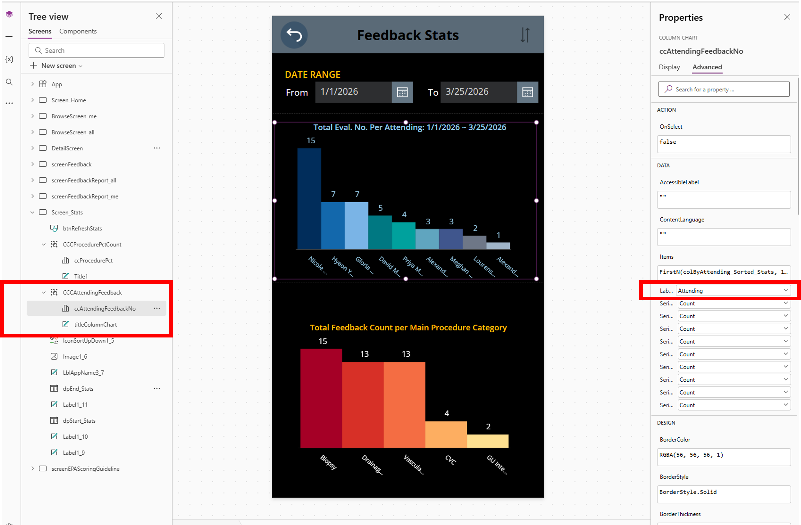
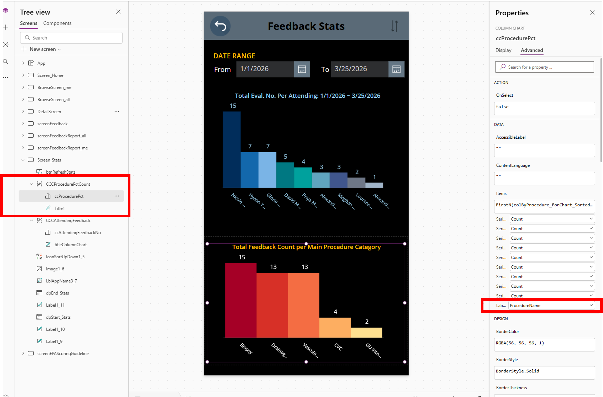

# Troubleshooting

## App Cannot Find SharePoint Data

Likely causes:
- SharePoint list names do not match the expected names
- data sources were not reconnected after import
- the app is still pointing to the original tenant's connections
- the target SharePoint schema was created incorrectly

Check:
1. confirm the SharePoint list names exactly match the expected names
2. open the app in Power Apps Studio
3. remove broken SharePoint data sources
4. reconnect the local SharePoint lists
5. verify the lists were created using [`02_MANUAL_SHAREPOINT_SCHEMA.md`](02_MANUAL_SHAREPOINT_SCHEMA.md)

## "My Feedback" Shows Wrong Records

Likely causes:
- `AttendingEmail` is missing or blank on old rows
- `AttendingEmail` was created as `Person or Group` instead of text
- the local app was modified to use `Attending` instead of `AttendingEmail`

Check:
1. create a new row and confirm `AttendingEmail` saves correctly
2. inspect old rows and backfill `AttendingEmail` if needed
3. verify formulas still use email-based filtering
4. confirm `AttendingEmail` is `Single line of text`

## Procedure Filtering Does Not Work

Likely causes:
- the procedure category list was renamed
- the main category field is not `Title`
- imported procedure pairs do not match the app's expected structure

Check:
1. confirm the list is named `Procedure_Categories_01`
2. confirm the main category field is `Title`
3. confirm the subcategory field structure matches the provided CSV files

## Stats Chart Labels Show Count or Metric Instead of Names

Likely causes:
- the chart labels are not hard-coded and reverted to the default chart fields after first connect or reconnect

Check:
1. open `Screen_Stats`
2. inspect `ccAttendingFeedbackNo.Items.Labels`
3. set it to `Attending` if it drifted
4. inspect `ccProcedurePct.Items.Labels`
5. set it to `ProcedureMain` if it drifted

This can happen even when the chart data itself is correct.

Visual references:

Note:
- some older app copies or cached Studio sessions may still surface a legacy procedure label field such as `ProcedureName`
- for the current external schema and current setup docs, the intended procedure label field is `ProcedureMain`

## PD/Admin Screens Are Missing or Everyone Can See Them

Likely causes:
- `AttendingRole` values do not match the expected role names
- the local attending list has missing or inconsistent role data

Check:
1. inspect `AttendingList`
2. confirm PD/admin users have expected role values
3. review the formulas if your institution uses different leadership titles

## Imported Columns Have Wrong Data Types

Likely causes:
- SharePoint inferred types incorrectly from CSV import

Important lesson:
- CSV-driven list creation can also create the wrong internal field names, not just the wrong visible types

Check these explicitly:
- `EvalDate`
- score-related fields
- comment fields
- email fields

Adjust SharePoint column types manually if needed, then retest the app.

Most important checks:
- `AttendingEmail` should be `Single line of text`
- `EmailAddress` should be `Single line of text`

## Existing Records Open but New Records Fail

Likely causes:
- a required column is missing
- a column name differs from what the app expects
- the display title looks correct but the internal field name does not match what the app expects
- a connector was not reattached correctly

Check:
1. compare local list schema against [`04_CONNECTION_MAP.md`](04_CONNECTION_MAP.md)
2. confirm all required columns exist
3. confirm Power Apps data-source warnings are resolved
4. if the app creates blank or partially blank rows, recreate the list manually instead of relying on CSV-driven schema creation

