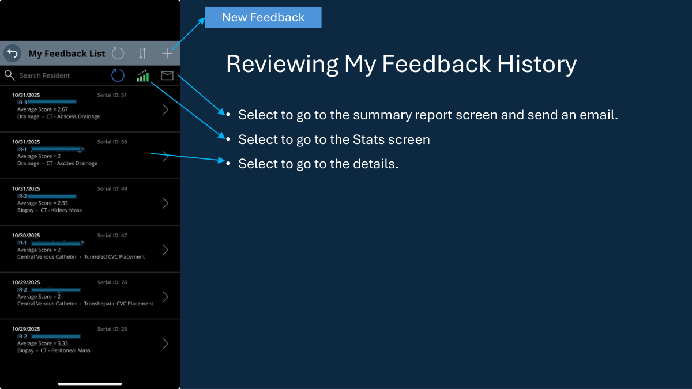
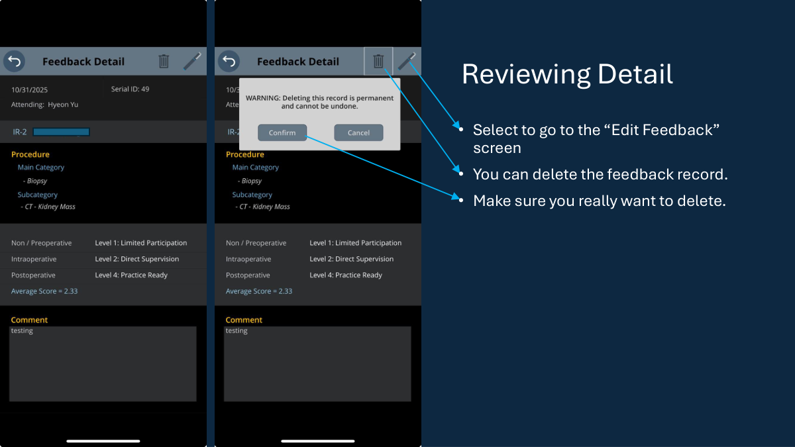
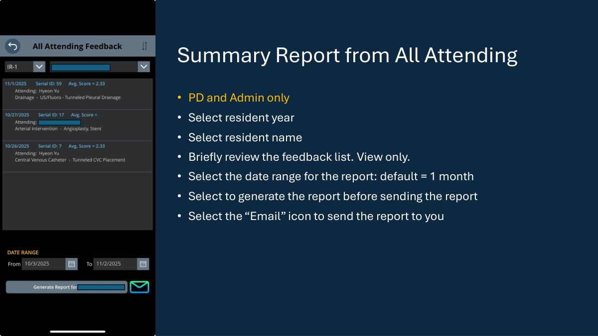
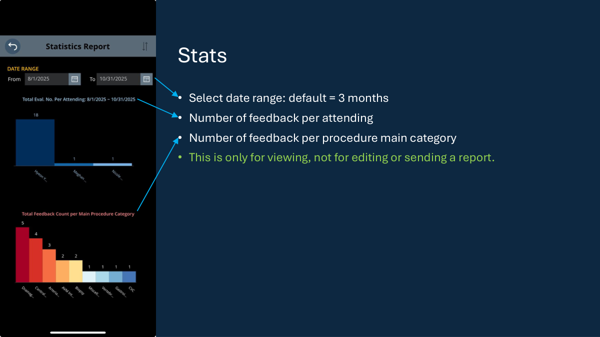

# User Guide

This guide is for end users and program leadership who want a visual walkthrough of the app.

For full setup and technical adoption instructions, use:
- [`03_SETUP_GUIDE.md`](03_SETUP_GUIDE.md)
- [`04_CONNECTION_MAP.md`](04_CONNECTION_MAP.md)

For the original slide-based version, see:
- [`Power_Apps_VIR_Resident_Evaluation_User_Guide.pdf`](assets/Power_Apps_VIR_Resident_Evaluation_User_Guide.pdf)

## Home Screen

The home screen is the entry point for the main workflows:
- create new feedback
- review personal feedback history
- generate personal summary reports
- review stats
- access PD/admin-only views

## Entering New Feedback

Core workflow:
- choose resident year
- choose resident name
- choose procedure main category
- choose procedure subcategory
- enter scores across the workflow phases
- enter comments
- submit

## Reviewing Feedback History

This screen supports:
- browsing prior feedback entries
- navigating to detail view
- moving to the summary-report flow
- accessing related stats

## Reviewing Details

The detail screen is where users inspect a specific feedback record and, depending on permissions, may edit or delete it.

## My Summary Report

This report flow allows a user to:
- filter by resident year and resident name
- review matching feedback rows
- choose a date range
- generate the report
- send the report by email

## All-Attending Summary Report

This view is intended for program leadership only.

Typical use:
- review all-attending feedback for a selected resident
- generate a date-bounded summary report
- send the report by email

## Stats

The stats screen gives a quick visual summary of:
- feedback volume by attending
- feedback volume by procedure category
- activity within a selected date range

## Notes

- PD/admin-only items depend on the `AttendingRole` values in `AttendingList`.
- Ownership-based views depend on `AttendingEmail`.
- Procedure filtering depends on preserving the main/subcategory structure in `Procedure_Categories_01`.
- On the stats screen, the x-axis labels are not hard-coded. After first connect or reconnect, they may revert to default chart labels such as `Count` and `Metric` and need to be reset.

